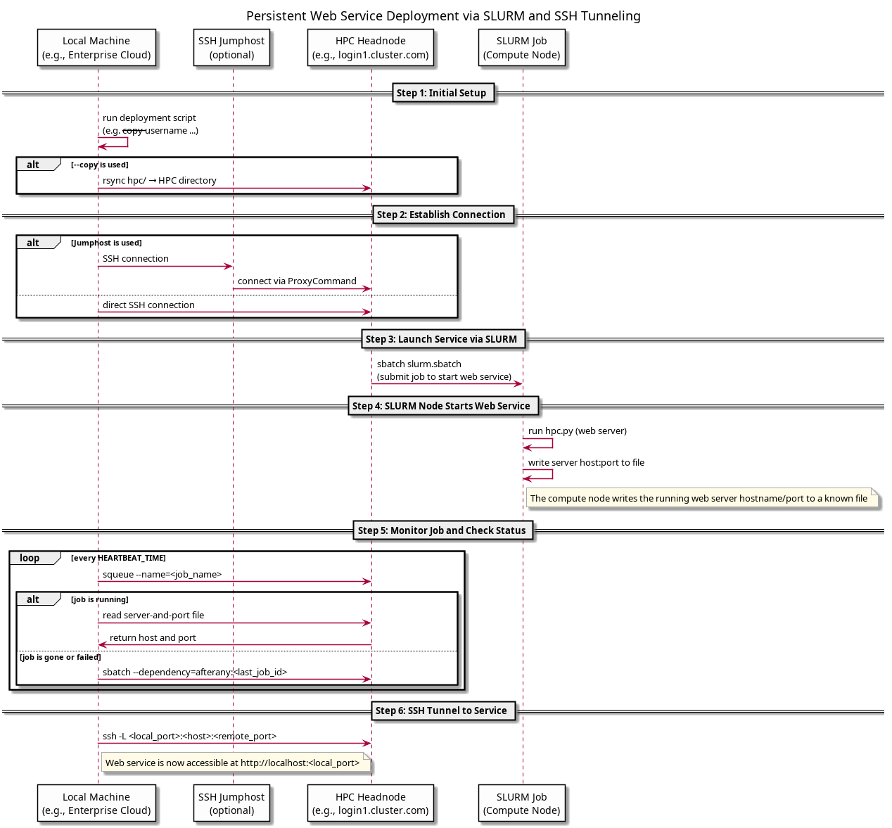

# Persistent Web Services on SLURM: Self-Monitoring Deployment with SSH Forwarding

This contains 2 scripts. One starts a very simple webserver on an HPC-system over SSH inside a sbatch job. This is a toy problem, and resides in the folder hpc. It is to be replaced with your own program.

The other one allows to keep that server in Slurm running by making sure a job is always there, and it's always responding, and restarts it when it's not, and forwards everything to localhost, so it can be used for an API.

This toolset enables you to deploy and persist a web-based service (e.g., an API to a resource-intensive Job) on SLURM-based HPC systems. It automatically monitors the service job, restarts it if necessary, and forwards the connection securely to your local machine (even across jumphosts). This is ideal for researchers, data scientists, and engineers who want to deploy long-running web services (like APIs, dashboards, or notebooks) on shared compute clusters without needing a permanent node allocation.

### Example Use Case

You’ve trained a large ML model on an HPC system and want to serve it via a REST API for your frontend team. This tool allows you to expose that model reliably via an HTTP server inside a SLURM job, monitor it, and access it from your local machine via SSH tunneling.

## How it works

1. A Slurm batch job is submitted that starts your web server.
2. A watcher script monitors whether the service is up and running. That job will then again submit itself, but with itself as a dependency, to create a chain of dependencies.
3. If the job fails or is not in the squeue anymore, it is restarted.
4. An SSH tunnel forwards the remote port to a local port, making it available on `localhost`.

Supports jumphosts, fallback headnodes, and custom retry behavior.

## How to run

### Preperations

Make sure you have ssh-keys generated with `ssh-keygen` and added to all `~/.ssh/authorized_keys` on all login nodes and jumphosts.

### Run-Command

For example, with a jumphost:

```bash
cd enterprise_cloud
bash run --hpc-system-url login1.partition.cluster-name.com --jumphost-url jumphost.com --local-hpc-script-dir ../hpc --username your_username --jumphost-username service --hpc-script-dir "/home/your_username/hpc_scripts" --copy
```

The `run` script will:
1. Optionally `rsync` your Slurm job files to the HPC (`--copy`)
2. Submit a SLURM job (`slurm.sbatch`) via SSH
3. Start a local watcher that monitors the job
4. Create an SSH tunnel to the remote service so it is accessable via localhost
5. Restart the job if required

## `--help`

```
  --hpc-system-url HPC_SYSTEM_URL
                        SSH target for primary HPC head-node (user@host)
  --fallback-system-url FALLBACK_SYSTEM_URL
                        SSH target for fallback HPC head-node
  --jumphost-url JUMPHOST_URL
                        Optional SSH jumphost in user@host form
  --local-hpc-script-dir LOCAL_HPC_SCRIPT_DIR
                        Local directory containing Slurm scripts
  --hpc-script-dir HPC_SCRIPT_DIR
                        Directory on the HPC System where the files should be copied to
  --copy                If set, rsync the script directory before anything else
  --debug               Verbose local shell output
  --retries RETRIES     SSH retry attempts before using fallback
  --local-port LOCAL_PORT
                        Local port to expose the remote service
  --heartbeat-time HEARTBEAT_TIME
                        Time to re-check if the server is still running properly
  --username USERNAME   SSH username for HPC and (by default) also for jumphost
  --jumphost-username JUMPHOST_USERNAME
                        SSH username for jumphost (defaults to --username)
  --hpc-job-name HPC_JOB_NAME
                        Name of the HPC job (defaults to slurm_runner)
  --server-and-port-file SERVER_AND_PORT_FILE
                        Globally available path to a file where the hostname and port for the host should be put on HPC (defaults to ~/hpc_server_host_and_file)
  --max-attempts-get-server-and-port MAX_ATTEMPTS_GET_SERVER_AND_PORT
                        Number of attempts to get the --server-and-port-file from the HPC (defaults to 60)
  --delay_between_server_and_port DELAY_BETWEEN_SERVER_AND_PORT
                        Delay between calls to the --server-and-port-file check on HPC (defaults to 5)
  --daemonize
```

### Template for slurm-side

In the Folder `hpc`, you will find the following files:

- `hpc.py`: Main example script, starts a simple webserver that accepts GET and POST calls and prints the Slurm-Job and nvidia-smi to prove that it is running on HPC
- `requirements.txt`: A list of requirements, automatically used when you run via the run script
- `run`: Run the hpc.py and install all dependencies if they are not installed
- `slurm.sbatch`: Start the job, also has a list of SLURM-requirements and chain-starts the next one

## Architecture


